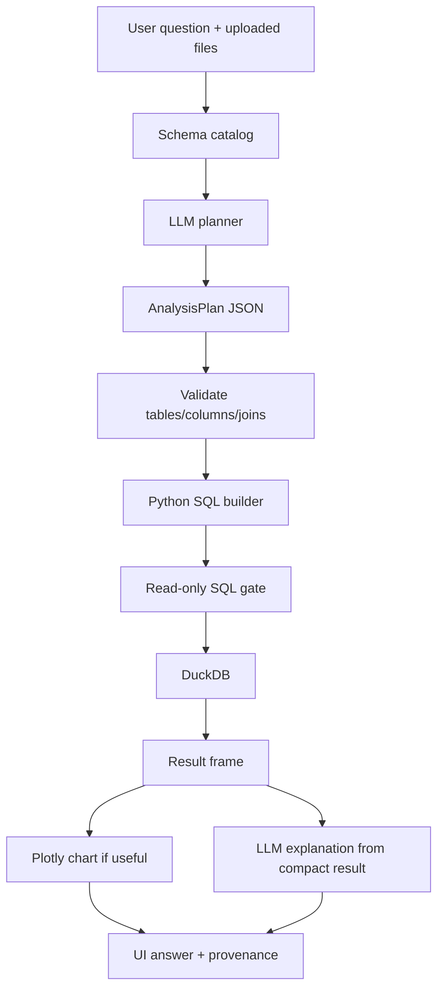

# DataPilot

**Upload your data. Ask questions. Get insights.**

A small, production-minded prototype for a Darwinbox Forward Deployed Engineer take-home: upload multiple CSV/Excel files, ask analytical questions in plain English, and get answers computed from the data—not guessed by a model.

## Problem statement

Business users can upload related spreadsheets (employees, attendance, performance, sales, and so on) and want trustworthy answers to questions like “which department has the highest average performance?” Generic chat-with-CSV tools often let the LLM invent numbers. DataPilot treats the model as a planner and DuckDB as the source of truth.

## Key features

- Multi-file CSV / Excel upload in one session
- Schema extraction (types, samples, null counts) without sending full datasets to the model
- Structured `AnalysisPlan` from the LLM (Pydantic, closed enums)
- Plan validation: tables, columns, joins, aggregations
- Deterministic SQL generation and read-only DuckDB execution
- Cross-file joins when questions span datasets
- Lightweight semantic column matching (`region` → `sales_region`) without renaming originals
- Ambiguity prompts instead of silent guessing
- Question-driven Plotly charts (only when they help)
- Lightweight provenance: files, columns, calculation, rows analyzed

## Architecture

```
                User
                 |
                 v
          Streamlit UI
                 |
                 v
          User Question
                 |
                 v
         LLM / OpenRouter
                 |
                 v
        Structured AnalysisPlan
                 |
                 v
        Plan Validation Layer
                 |
                 v
      Deterministic SQL Builder
                 |
                 v
              DuckDB
                 |
         +-------+-------+
         |               |
         v               v
   Visualization     Explanation
                 |
                 v
            Final Answer
```



## Data flow

1. Files are parsed with pandas and registered as in-memory DuckDB tables.
2. Only catalog metadata (and small samples) go to the LLM.
3. The LLM returns an `AnalysisPlan`, not SQL and not numbers.
4. Validators resolve columns and reject unknown tables, impossible joins, and illegal aggregations.
5. Python builds a `SELECT` statement. DuckDB computes the result.
6. The UI shows a short explanation, an optional chart, a result table, and analysis details.

## Why DuckDB

DuckDB runs analytical SQL on pandas frames in-process. Aggregations, joins, filters, and sorts are deterministic, fast, and independent of model temperature. That is the right engine for “numbers the business can trust.”

## Why the LLM does not calculate answers

The model is good at *semantic* work: intent, relevant columns, likely joins, chart choice, and phrasing. It is a poor source of truth for totals and averages. DataPilot’s rule is:

**LLM proposes. Code validates. DuckDB computes. UI explains.**

Explanations are generated from a compact result preview so the model cannot “remember” a different number than the query returned.

## Cross-file analysis approach

Joins are suggested by the model and checked by the backend: both tables must exist, join columns must exist, and types must be compatible. If the model omits joins but multiple tables are required, DataPilot infers a lightweight same-name key (typically `employee_id`). There is no graph database—just enough relationship detection to answer HR-style questions across files.

## Delta solutioning

These are the differentiators versus “paste a CSV into ChatGPT”:

1. Deterministic computation with DuckDB
2. Schema-aware query planning
3. Cross-file analysis
4. Lightweight semantic column matching
5. Ambiguity detection
6. Scope guardrails
7. Result provenance
8. Question-driven visualization

### Scope guardrails

A question is answered only if its vocabulary appears in the uploaded schema. `detect_out_of_scope` compares the question's words against table names, file names, column names and the distinct values of small categorical columns. If nothing matches, DataPilot says what the files actually cover instead of inventing an answer. The planner prompt carries the same rule through an `out_of_scope` flag, so general-knowledge and chit-chat questions are rejected on both the deterministic and the model side.

### Ambiguity detection

`detect_ambiguity` maps each meaningful word in the question to the numeric columns it could mean. When a single word (for example "days" against `working_days`, `present_days` and `leave_days`) matches two or more measures, DataPilot asks which one to use and lists the candidates by file name rather than guessing. Questions that spell out a full column name, such as "average performance score", skip the check.

### Numeric precision

Every aggregate is wrapped in `ROUND(CAST(... AS DOUBLE), 2)` inside DuckDB, and float columns in the result frame are rounded to the same two decimals. The answer text, the table and the chart therefore always show the identical value, and the explanation model is told the numbers are already rounded.

## Tech stack

- Python 3.11+
- Streamlit
- Pandas, OpenPyXL, DuckDB
- Plotly
- Pydantic
- OpenRouter (`deepseek/deepseek-v4-flash-0731:free` by default)

## Setup

```bash
python -m venv .venv
# Windows
.venv\Scripts\activate
# macOS / Linux
source .venv/bin/activate

pip install -r requirements.txt
```

## Environment variables

Copy `.env.example` to `.env` and set your key:

```bash
OPENROUTER_API_KEY=your_openrouter_api_key_here
MODEL=deepseek/deepseek-v4-flash-0731:free
OPENROUTER_BASE_URL=https://openrouter.ai/api/v1
```

Never commit `.env`. Secrets are read at runtime only.

## How to run

From the project root:

```bash
streamlit run app.py
```

Upload the files in `sample_data/` (or your own), then ask a question or click an example.

Regenerate sample data if needed:

```bash
python scripts/generate_sample_data.py
```

## Example questions

1. Which department has the highest average performance score?
2. What is the average attendance by department?
3. Which location has the highest number of employees?
4. How did average performance change over time?
5. Compare attendance between Bangalore and Hyderabad.
6. Which department has the lowest attendance?
7. Does the department with the lowest attendance also have the lowest performance?

## Testing

```bash
pytest
```

Coverage includes file loading, plan parsing, validation failures, dangerous SQL rejection, cross-file queries, empty results, and malformed LLM output.

## Known limitations

- Best for tidy, spreadsheet-shaped tables; nested JSON and messy merged Excel headers are out of scope.
- Join inference is name/type based, not a full schema graph.
- Semantic matching is structural (shared tokens), not a trained entity linker.
- Very large files are not chunked or sampled for compute—DuckDB still holds the frame in memory.
- Chart choice depends on the plan; unusual question phrasing can yield a table-only answer.
- Free OpenRouter models may rate-limit or change availability.

## Future improvements

- Explicit user confirmation of inferred joins
- Saved analysis recipes for repeated questions
- Richer derived metrics (cohorts, period-over-period) still generated in SQL, not by the LLM
- Optional export of the result table
