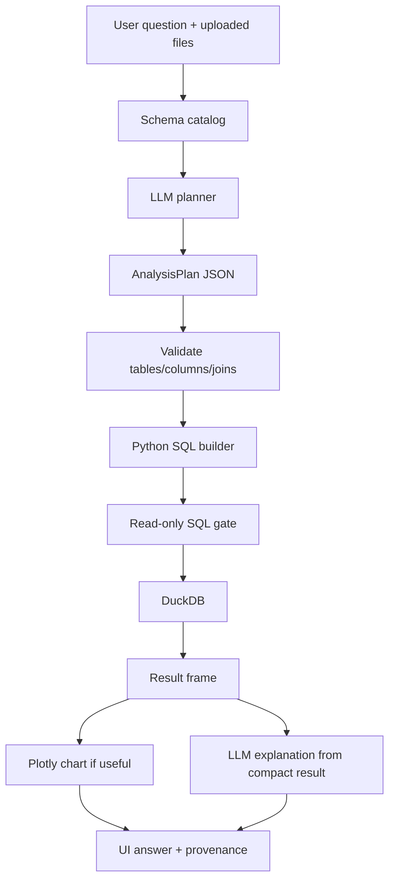

# DataPilot

**Upload your data. Ask questions. Get insights.**

Live demo: **[https://ai-datapilot.streamlit.app/](https://ai-datapilot.streamlit.app/)**

Demo video: **[Demo_video.mp4](Demo_video.mp4)** — a short walkthrough of upload, ask, and insights. (Please download the demo vedio to watch it).

DataPilot lets you upload CSV/Excel files and ask analytical questions in plain English. Answers are **computed from your data with DuckDB** — the LLM only plans the query, it does not invent answers.

---

## Try it now

1. Watch the demo video: [Demo_video.mp4](Demo_video.mp4)
2. Open the live app: [https://ai-datapilot.streamlit.app/](https://ai-datapilot.streamlit.app/)
3. Upload one or more CSV / Excel files (or use the sample files from `sample_data/`)
4. Ask a question or click an example
5. Review the answer, chart (if useful), result table, and analysis details

---

## What it does

| Step | What happens |
|------|----------------|
| 1. Upload | Files become in-memory DuckDB tables; schema is extracted |
| 2. Ask | You type a business question in plain English |
| 3. Plan | The LLM returns a structured `AnalysisPlan` (not SQL, not numbers) |
| 4. Validate | Tables, columns, joins, and aggregations are checked |
| 5. Compute | Python builds SQL → DuckDB runs it (source of truth) |
| 6. Explain | A short answer + optional chart + provenance |

**Rule:** LLM proposes → code validates → DuckDB computes → UI explains.

---

## Key features

- Multi-file CSV / Excel upload in one session
- Schema catalog for the model — full data stays local
- Structured planning with Pydantic (`AnalysisPlan`)
- Deterministic SQL + read-only DuckDB execution
- Cross-file joins when a question spans datasets
- Ambiguity prompts instead of silent guessing
- Out-of-scope guardrails for chit-chat / unrelated questions
- Live step progress while analysis runs
- Question-driven Plotly charts
- Provenance: files used, columns, calculation, rows analyzed

---

## Architecture

```
User → Streamlit UI → Question
         → LLM planner (OpenRouter) → AnalysisPlan
         → Validators → SQL builder → DuckDB
         → Chart + explanation → Answer
```



---

## Tech stack

- Python 3.11+
- Streamlit
- Pandas, OpenPyXL, DuckDB
- Plotly, Pydantic
- OpenRouter (default: `deepseek/deepseek-v4-flash-0731:free`)

---

## Local setup

```bash
python -m venv .venv
# Windows
.venv\Scripts\activate
# macOS / Linux
source .venv/bin/activate

pip install -r requirements.txt

```


### Environment variables

Copy `.env.example` to `.env` (or create `.env`) and set:

```bash
OPENROUTER_API_KEY=your_openrouter_api_key_here
MODEL=deepseek/deepseek-v4-flash-0731:free
OPENROUTER_BASE_URL=https://openrouter.ai/api/v1
APP_TITLE=DataPilot
MAX_RESULT_ROWS=50
LLM_TIMEOUT_SECONDS=60
AI_NARRATION=true
```


### Run

```bash
streamlit run app.py
```

Sample data: `sample_data/`. Regenerate with:

```bash
python scripts/generate_sample_data.py
```

---

## Example questions

1. Which department has the highest average performance score?
2. What is the average attendance by department?
3. Which location has the highest number of employees?
4. How did average performance change over time?
5. Compare attendance between Bangalore and Hyderabad.
6. Which department has the lowest attendance?
7. Does the department with the lowest attendance also have the lowest performance?

---

## Testing

```bash
pytest
```

Covers file loading, plan parsing, validation failures, dangerous SQL rejection, cross-file queries, empty results, and malformed LLM output.

---

## Known limitations

- Best for tidy spreadsheet-style tables (messy merged Excel headers are out of scope)
- Join inference is name/type based, not a full schema graph
- Large files are held in memory (no chunked compute yet)
- Free OpenRouter models can be slow or rate-limited under load

---

## Future improvements

DataPilot already answers questions from uploaded spreadsheets. These are the next steps to make it faster, safer, and easier for everyone .

### Make answers more trustworthy
- Use a paid AI model so the app is less likely to slow down or fail when many people use it


### Keep data safe
- Keep each user's uploaded files private to their own session
- Store API keys only in the host's secret settings — never in the code or in logs
- Keep a simple activity log of questions asked, without saving personal details by default
- Keep queries read-only (view data only; never change or delete it)

### Handle bigger files
- Set a file-size limit and show a friendly message when a file is too large
- Load large CSVs in parts instead of holding everything in memory at once
- Optionally save data in a database so it does not disappear when the session ends
- Remember recent questions for the same files so repeat asks are faster
- For slow questions, keep working in the background and show progress

### Many tables — hybrid search

If the system grows to hundreds or thousands of tables, sending the entire schema to the LLM would increase token usage, latency, and noise.

Instead, introduce a schema retrieval layer:

1. Search the metadata catalog using table and column names.
2. Use semantic matching for cases where business language differs from database names (for example, "revenue" vs. `fact_sales`).
3. Send only the most relevant tables and columns to the LLM.
4. Let the LLM generate the analysis plan or SQL using this focused schema context.

This can be implemented using keyword search combined with embeddings or LLM reranking. A separate vector database is not required; an existing PostgreSQL database with full-text search and `pgvector` can store the schema metadata and embeddings.

Only schema and metadata are indexed — not the underlying data rows.

For production workloads, SQL execution should happen against the organization's analytical database or warehouse (such as PostgreSQL, Snowflake, or BigQuery). DuckDB can continue to handle smaller user-uploaded CSV/Excel files locally, while the warehouse remains the system of record for large datasets.

### Make the product nicer to use
- Let people save favorite questions and reuse them later
- Export the answer, table, and chart (CSV, image, or PDF)
- Remember the last question so follow-ups like “now by location” work

### Watch how the app is doing
- Track how often answers succeed, how long they take, and why they fail
- Show whether the AI service is up
- Alert the team if many analyses start failing

### Watch the AI — Langfuse

Use Langfuse to trace each run (plan → SQL → explanation): latency, errors, model, cost. Do not store uploaded files or personal data by default. Langfuse is observability only.

### Improve data quality
- On upload, warn about missing values, duplicate IDs, or mixed column types
- Support common business calcs (this month vs last month) in code ,not by guessing numbers
- Let teams define official meanings for terms like “revenue” or “attendance rate” so everyone gets the same calculation

---

## Repository

GitHub: [https://github.com/lalitha145/AI_DataPilot](https://github.com/lalitha145/AI_DataPilot)
