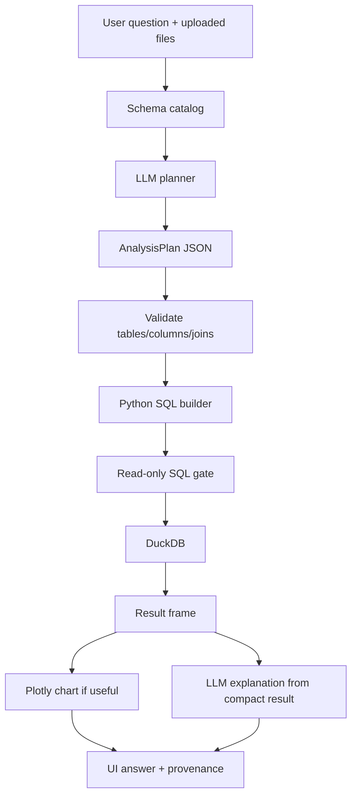

# DataPilot

**Upload your data. Ask questions. Get insights.**

Live demo: **[https://ai-datapilot.streamlit.app/](https://ai-datapilot.streamlit.app/)**

DataPilot lets you upload CSV/Excel files and ask analytical questions in plain English. Answers are **computed from your data with DuckDB** — the LLM only plans the query, it does not invent numbers.

---

## Try it now

1. Open the live app: [https://ai-datapilot.streamlit.app/](https://ai-datapilot.streamlit.app/)
2. Upload one or more CSV / Excel files (or use the sample files from `sample_data/`)
3. Ask a question or click an example
4. Review the answer, chart (if useful), result table, and analysis details

---

## What it does

| Step | What happens |
|------|----------------|
| 1. Upload | Files become in-memory DuckDB tables; schema is extracted |
| 2. Ask | You type a business question in plain English |
| 3. Plan | The LLM returns a structured `AnalysisPlan` (not SQL, not numbers) |
| 4. Validate | Tables, columns, joins, and aggregations are checked |
| 5. Compute | Python builds SQL → DuckDB runs it (source of truth) |
| 6. Explain | A short answer + optional chart + provenance |

**Rule:** LLM proposes → code validates → DuckDB computes → UI explains.

---

## Key features

- Multi-file CSV / Excel upload in one session
- Schema catalog for the model (types, samples) — full data stays local
- Structured planning with Pydantic (`AnalysisPlan`)
- Deterministic SQL + read-only DuckDB execution
- Cross-file joins when a question spans datasets
- Ambiguity prompts instead of silent guessing
- Out-of-scope guardrails for chit-chat / unrelated questions
- Live step progress while analysis runs
- Question-driven Plotly charts
- Provenance: files used, columns, calculation, rows analyzed

---

## Architecture

```
User → Streamlit UI → Question
         → LLM planner (OpenRouter) → AnalysisPlan
         → Validators → SQL builder → DuckDB
         → Chart + explanation → Answer
```



---

## Tech stack

- Python 3.11+
- Streamlit
- Pandas, OpenPyXL, DuckDB
- Plotly, Pydantic
- OpenRouter (default: `deepseek/deepseek-v4-flash-0731:free`)

---

## Local setup

```bash
python -m venv .venv
# Windows
.venv\Scripts\activate
# macOS / Linux
source .venv/bin/activate

pip install -r requirements.txt
```

### Environment variables

Copy `.env.example` to `.env` (or create `.env`) and set:

```bash
OPENROUTER_API_KEY=your_openrouter_api_key_here
MODEL=deepseek/deepseek-v4-flash-0731:free
OPENROUTER_BASE_URL=https://openrouter.ai/api/v1
APP_TITLE=DataPilot
MAX_RESULT_ROWS=50
LLM_TIMEOUT_SECONDS=60
AI_NARRATION=true
```

Never commit `.env`. On Streamlit Cloud, set the same keys under **Manage app → Settings → Secrets** (TOML format).

### Run

```bash
streamlit run app.py
```

Sample data: `sample_data/`. Regenerate with:

```bash
python scripts/generate_sample_data.py
```

---

## Example questions

1. Which department has the highest average performance score?
2. What is the average attendance by department?
3. Which location has the highest number of employees?
4. How did average performance change over time?
5. Compare attendance between Bangalore and Hyderabad.
6. Which department has the lowest attendance?
7. Does the department with the lowest attendance also have the lowest performance?

---

## Testing

```bash
pytest
```

Covers file loading, plan parsing, validation failures, dangerous SQL rejection, cross-file queries, empty results, and malformed LLM output.

---

## Known limitations

- Best for tidy spreadsheet-style tables (messy merged Excel headers are out of scope)
- Join inference is name/type based, not a full schema graph
- Large files are held in memory (no chunked compute yet)
- Free OpenRouter models can be slow or rate-limited under load

---

## Roadmap — production-grade improvements

These are the next steps to take DataPilot from a solid prototype toward production readiness:

### Reliability & correctness
- **Paid / dedicated LLM endpoint** (e.g. Groq or a non-free OpenRouter model) for stable latency and fewer rate limits
- **Plan + SQL replay tests** against golden datasets so regressions are caught in CI
- **Stronger join confirmation** — show inferred joins and let the user confirm before running
- **Query cost / row limits** with clear UI feedback when results are truncated

### Security
- **Per-user / per-session isolation** for uploaded data (no cross-session leakage)
- **Secrets management** via platform vaults only (never in repo or client logs)
- **Audit logging** of questions asked and queries executed (without storing raw PII by default)
- **Stricter SQL allow-list** and sandboxing for any future write-related features

### Scale & performance
- **File size limits** and streaming / chunked ingest for large CSVs
- **Optional persistent warehouse** (DuckDB file, MotherDuck, or Postgres) instead of memory-only
- **Caching** of catalogs and repeated analysis plans for the same schema + question
- **Async / background jobs** for long-running analyses with progress notifications

### Product experience
- **Saved questions & recipes** for recurring business reports
- **Export** answers, tables, and charts (CSV / PNG / PDF)
- **Multi-turn clarification** that keeps context across follow-ups
- **Role-based access** (viewer vs analyst) for team deployments

### Observability & ops
- **Structured metrics**: plan success rate, LLM latency, DuckDB time, error taxonomy
- **Health checks** and dependency status (LLM provider, storage)
- **Staging vs production** configs and automated deploy from `main`
- **Alerting** on spike in failed plans or provider outages

### Data quality
- **Upload-time profiling** (missing values, duplicate keys, type mismatches) with warnings
- **Derived metrics library** (period-over-period, cohorts) still generated as SQL, not by the LLM
- **Semantic layer** (approved metric definitions) so business terms map to one canonical calculation

---

## Repository

GitHub: [https://github.com/lalitha145/AI_DataPilot](https://github.com/lalitha145/AI_DataPilot)
